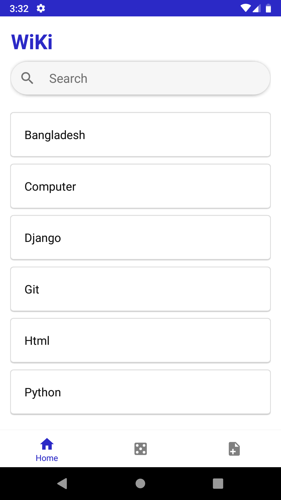
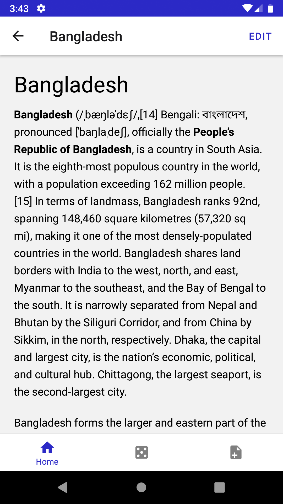
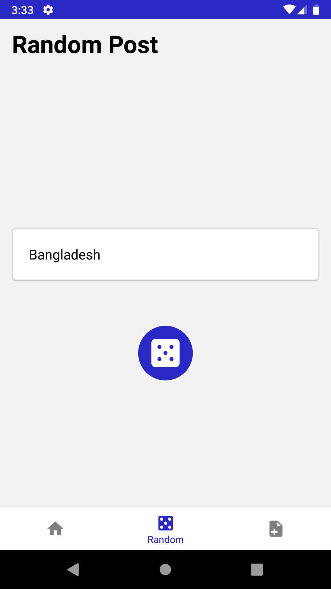
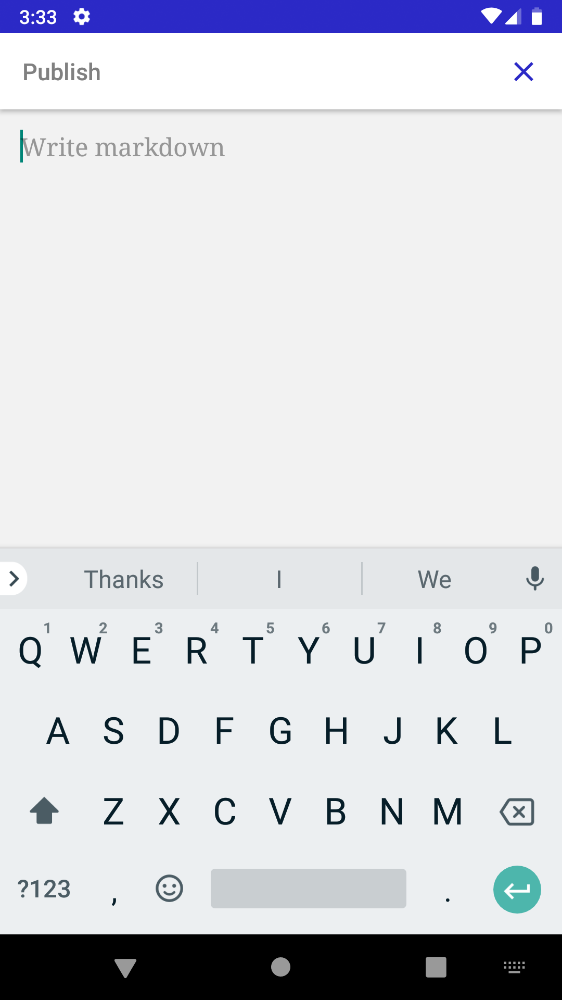
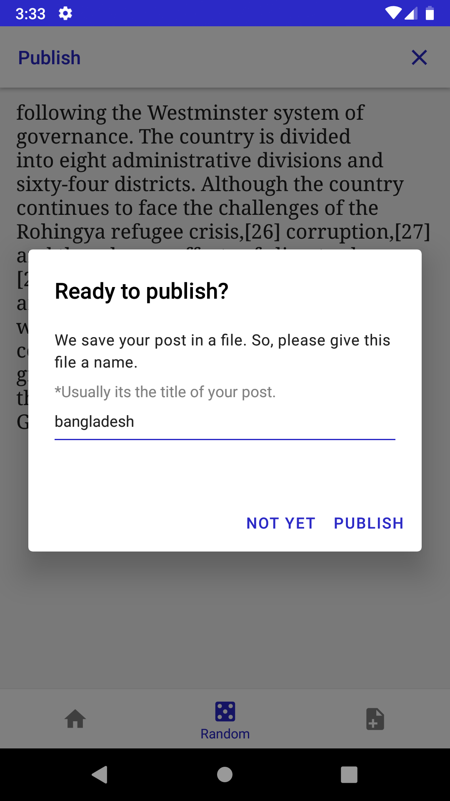

# Wiki - Android

An android implementation of <a href="https://wiki-client.netlify.app/">Wiki</a>, a Wikipedia-like encyclopedia.

# About

Wikipedia is a free online encyclopedia that consists of several encyclopedia entries on various topics.

Each encyclopedia entry can be viewed by visiting that entry’s page. Visiting https://en.wikipedia.org/wiki/HTML, for example, shows the Wikipedia entry for HTML. Notice that the name of the requested page (HTML) is specified in the route /wiki/HTML. Recognize too, that the page’s content must just be HTML that your browser renders.

In practice, it would start to get tedious if every page on Wikipedia had to be written in HTML. Instead, it can be helpful to store encyclopedia entries using a lighter-weight human-friendly markup language. Wikipedia happens to use a markup language called Wikitext, but for this project, we’ll store encyclopedia entries using a markup language called Markdown.

By having one Markdown file represent each encyclopedia entry, we can make our entries more human-friendly to write and edit. When a user views our encyclopedia entry, though, we’ll need to convert that Markdown into HTML before displaying it to the user.

We can use the web application [here](https://wiki-client.netlify.app/).

**This app is the android implementation of the above web application.**

## Features

This app lets you:

- Read posts.
- Edit existing posts.
- Write new posts.
- Search posts in realtime.
- Read a random post.

## Usages

**Home**: Displays all posts. Click on a card to read the post. Tap and write in the search bar to search for posts.
**Random**: Displays a random post. Tap the dice icon to generate a random post. Click on a card to read the post.
**New**: Write a new post in Markdown. Your post will be saved in a file. Pressing the `Publish` button will open a modal where you'll be asked to provide a name for the file. The `Publish` button will work until the length of the content is greater than 0. Pressing the `x` icon will remove the post content.
**Edit**: On the detail screen there is an option to edit the post. Pressing the `Edit` button will place the post content in an editable component where users can edit that post. After edition publishing, the post will remember the file name. If we provide a new name, a new file will be created.
**Search**: Writing in the search bar will display matched post names.

## Screenshots

## Setup

1. Clone or download this repo.
2. Install Expo globally.
   `npm install --global expo-cli`
3. Install dependencies.
   `npm install` or `yarn install`
4. Starting the development server.
   `expo start`
5. Build. See detail instruction [here](https://docs.expo.io/distribution/building-standalone-apps/)
   `expo build:android`

## Libraries/Frameworks

- [React Native](https://reactnative.dev/)
- [Expo](https://docs.expo.io/)
- [React Navigation](https://reactnavigation.org/)
- [React Native Paper](https://callstack.github.io/react-native-paper/)
